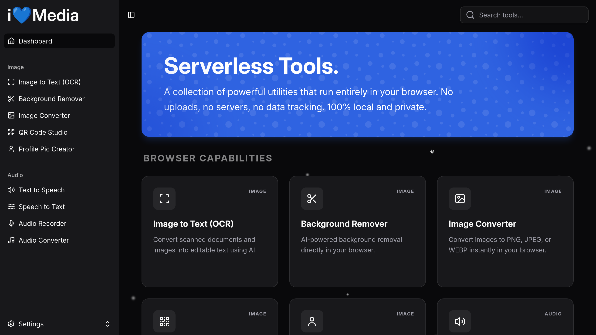

<div align=center>

# i💙Media



</div>

## Overview

iLoveMedia is a high-performance, privacy-first web application providing a suite of serverless tools. All processing occurs exclusively within the user's browser using advanced technologies like WebAssembly (WASM), ensuring that sensitive data never leaves the local device.

It is designed for professionals and casual users who need powerful utilities like image conversion, audio processing, or OCR without the privacy risks associated with uploading files to remote servers.

## Features

- **Image Tools**:
    - [x] OCR: Extract text from images.
    - [x] Background Remover: Remove backgrounds using AI.
    - [x] QR Studio: Generate custom QR codes.
    - [x] Emoji Art: Convert text into patterns of emojis.
- **Audio Tools**:
    - [x] Audio Converter: Change formats (e.g., WAV to MP3) using FFmpeg.
    - [x] Text-to-Speech: High-quality synthesis using system voices or the Kokoro AI model.
    - [x] Speech-to-Text: Live transcription via browser API or Whisper AI.

### Architecture

The application follows a modular Vue-based architecture. It is strictly "Serverless" in the sense that it requires no backend logic to function; all heavy lifting is delegated to browser-side libraries and WASM modules.

Below is a list of amazing opensource projects on top of which iLoveMedia is built;

- **Frontend**: [Vue.js 3](https://vuejs.org), [Vite.js](https://vite.dev), [Shadcn-Vue](https://github.com/unovue/shadcn-vue)
- **Styling**: [TailwindCSS](https://tailwindcss.com)
- **AI/ML Engines**:
    - `@imgly/background-removal`: For local image segmentation.
    - `tesseract.js`: For Optical Character Recognition.
    - `@xenova/transformers`: For running Whisper (Speech-to-Text) and Kokoro (TTS) models.
- **Binary Utilities**:
    - `@ffmpeg/ffmpeg`: Multi-format audio processing via WASM.

### Performance Considerations

- **Lazy Loading**: Heavy AI models (like Whisper or Kokoro) are only initialized when the user selects the corresponding tool.
- **Memory Management**: `URL.createObjectURL` is used for handling file previews. These are revoked as needed to prevent memory leaks during long sessions.
- **Worker Threads**: FFmpeg and Transformers.js utilize Web Workers to ensure the main UI thread remains responsive during intensive calculations.

## Project Setup

To setup iLoveMedia locally, follow the steps below;

- Clone this repository

```sh
git clone https://github.com/henryhale/iLoveMedia.git
```

- Install all dependencies

```sh
pnpm install
```

- Run dev server

```sh
pnpm dev
```

- Build for production

```sh
pnpm build
```

## Contributions

I'm glad you checked out iLoveMedia. Thank you very much.
All contributions are welcome.
For any bug or issue, kindly open one [here](https://github.com/henryhale/iLoveMedia/issues).

## License

Copyright (c) 2025-present [Henry Hale](https://github.com/henryhale/).

Released under the [MIT License](https://github.com/henryhale/iLoveMedia/blob/master/LICENSE.txt).
